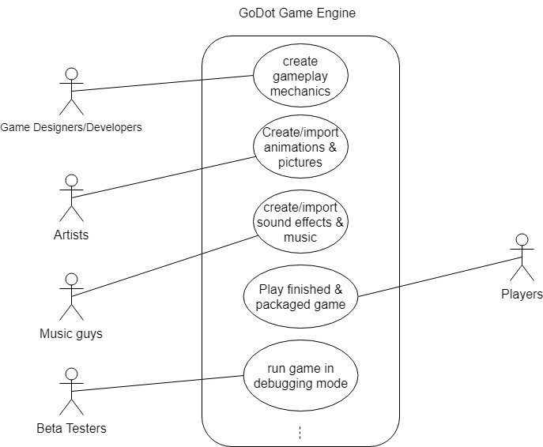

# Geno Maresca GoDot Project Proposal

## Project Abstract
GoDot engine is a program that allows users to create their own video games (similar to Unity or Unreal Engine but Godot is open source). GoDot engine itself is written in C++ but it allows users to code anything they want to create in the engine itself using its own custom language called GDscript (which is syntactically similar to python). It works by treating everything in the engine as a “Node” which is basically a blank object you can then drag and drop presented scripts onto to turn this node into a player character, UI element, game camera, obstacle, projectile, etc. You can also write custom scripts using GDScript. It has almost all the functionality of other bigger game engines with the potential to make any 2D, 3D and even VR/AR games the user can imagine. It has a gui to allow users to drag and drop all these elements into their games and it has display window to allow for setting up game scenes in 2D/3D space and for play testing. 

## Project Relevance
The project is relevant to the learning objectives of this course because of how well it teaches project management and working in a team atmosphere. GoDot is updated and maintained entirely by it community of people who want to develop features for it and fix it. Because of this contributing to the project teaches us how to use Github which is one of the most popular tools for source code management. We will also gain a lot of experience working with legacy code as the engine is already well developed with many useful features. In addition to learning about source code management, we will also be learning how to adapt our coding styles to fit the format required for development on GoDot, and learning their coding standard. We will also gain experience using project management tools both inside and outside of Github. The github repo for GoDot has a large list of current open issues for new features the community wants to add and bugs that have been reported. We will learn how to pick up new tasks and then further how to distribute the work for said tasks amongst ourselves (using tools like trello or our own github project board).  

## Conceptual Design
On the GoDot Github there are currently many issues open outlining new features the community would like to have in the engine and bugs that have been reported. I propose we select a couple issues from here we deem are important and manageable for us to complete. 
This is good because we can just delve deep into these issues and we don’t have to learn too much into how the entire engine works as a whole, and we can focus more on the issues surrounding the bug or what the new feature will be working with. This means we can spend more time working together, learning how to work on the project, and learning the syntax their code needs to follow in order to get approved.

## Background
The Github repo for GoDot can be found [here](https://github.com/godotengine/godot).

## Required Resources
A mac, Windows, or Linux machine as that’s all the engine can run on and it’s also all the engine can build to currently. 
